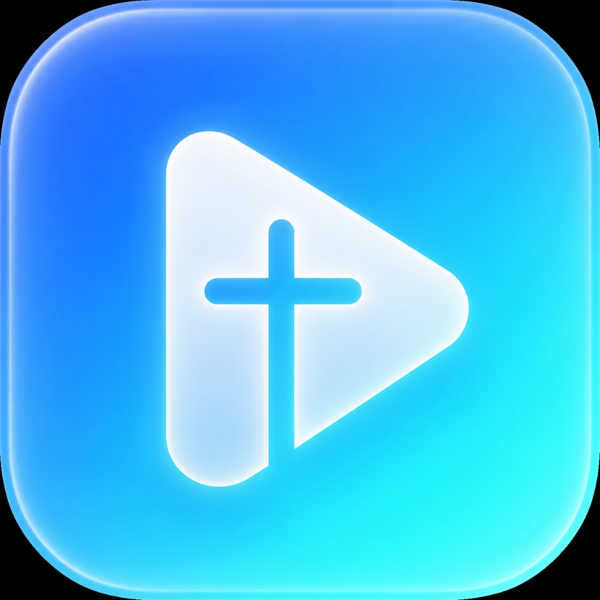

# ✝️ Church Media Master (교회 스마트 방송 플레이어 Pro)

교회 예배 및 행사를 위해 제작된 고성능 독립형(Offline 100%) 미디어 송출 및 찬양 비주얼라이저 데스크톱 소프트웨어입니다.



---

## ✨ 주요 기능

- 🎬 **16:9 Cinema 뷰포트 & 앰비언트 글로우 백라이트**: 예배당 분위기에 맞춘 몰입감 넘치는 화면 연출
- 🖥️ **스마트 다중 모니터 셀렉터**: 연결된 프로젝터/TV 보조 모니터를 감지하여 원클릭 클린 송출
- 🎵 **60fps 오디오 비주얼라이저**: 찬양 BGM 재생 시 은혜로운 네온 스펙트럼/파형/펄스 파티클 렌더링
- 🚨 **방송실 긴급 스위치**: 설교/멘트 시 20% 볼륨 덕킹(D), 대기 로고(L), 긴급 블랙아웃(B)
- 🚀 **원클릭 자동 업데이트(Auto-Updater)**: GitHub Releases 연동을 통한 실시간 백그라운드 업데이트 지원
- 🔒 **100% 완전 오프라인 구동**: 인터넷 연결이 없는 지하 예배실에서도 단독 실행 가능

---

## 🛠️ 실행 및 빌드

```bash
# 1. 의존성 설치
pip install pywebview Pillow

# 2. 프로그램 실행
python ChurchPlayer.py

# 3. 배포용 EXE 빌드
python -m PyInstaller --noconfirm --onedir --windowed --name "ChurchPlayer" --icon="app_icon.ico" --add-data "index.html;." --add-data "live.html;." --add-data "app_icon.png;." --add-data "css;css" --add-data "js;js" ChurchPlayer.py
```